## Giám sát mạng
### Task 1: Local Logging: Cấu hình, Giám sát và Phân tích Windows Logs

Brute Force Attacks vào Windows Remote Desktop 

Cú pháp: `hydra -t 1 -V -f -l Jason -P /usr/share/wordlists/rockyou.txt rdp://192.168.108.194`

Kết quả:

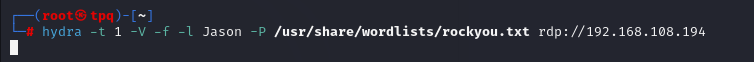 

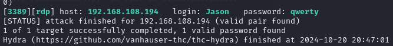

==> Thành công với `user&pass: Jason:qwerty`

 Brute Force Attacks vào Windows FTP Service 

 Cú pháp: `hydra -V -t 4 -l Martin -P /usr/share/wordlists/rockyou.txt ftp://192.168.108.194`

 Kết quả: 
 
 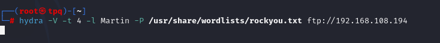 
 
 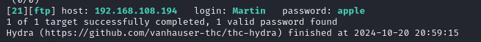
 
  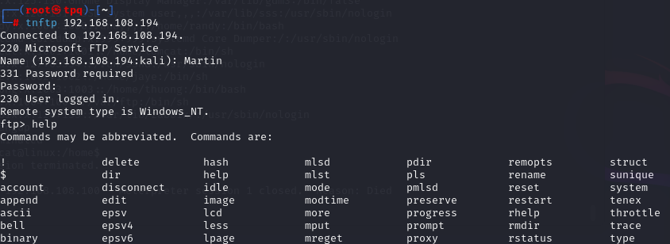

Dùng Event Viewer trên windows server 2022 để lọc các tấn công brute force mã `event ID 4625`

Kết quả: rất nhiều login với tên Jason và ip login

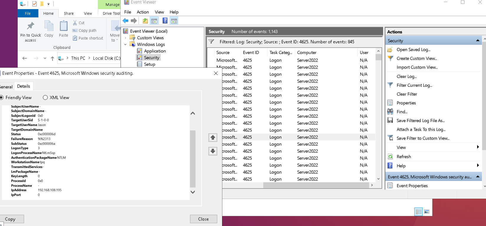

#### Các Event ID khác 
| Event ID | Trường hợp sinh ra/Lý do giám sát | 
| -------  | --------------------------------- |
| 4625 (Failed logon) | -  Được ghi lại khi đăng nhập không thành công vào máy tính   - Để phát hiện các cuộc tấn công brute-force, từ điển và các cuộc tấn công đoán mật khẩu khác, được đặc trưng bởi sự gia tăng đột ngột trong các lần đăng nhập bị lỗi   - Để đạt được điểm chuẩn cho cài đặt chính sách ngưỡng khóa tài khoản   - Trường thông tin được cung cấp: Security ID, Account Name, Account, Domain, Logon ID | 
| 4624 (Successful logon) | - Sự kiện này ghi lại khi một người dùng đăng nhập thành công vào hệ thống   - Phát hiện truy cập trái phép theo dõi những lần đăng nhập thành công là cần thiết để phát hiện nếu có tài khoản bị chiếm dụng   - Kiểm tra hoạt động người dùng ghi nhận hoạt động đăng nhập của người dùng giúp theo dõi ai đang truy cập hệ thống và thời gian đăng nhập của họ   - Logon Type phổ biến: 2- đăng nhập cục bộ (tại máy tính), 3 - đăng nhập qua mạng (chia sẻ tệp hoặc ứng dụng), 10 - đăng nhập từ xa (Remote Desktop) | 
| 4634 (Logoff) | - Sự kiện này ghi lại khi một người dùng đã đăng xuất khỏi hệ thống   - Theo dõi sự kết thúc phiên đăng nhập kết hợp sự kiện này với sự kiện 4624 để theo dõi thời gian người dùng đã đăng nhập bao lâu và khi nào họ đăng xuất   - Phát hiện hoạt động bất thường nếu có quá nhiều lần đăng nhập và đăng xuất trong thời gian ngắn, điều này có thể chỉ ra hoạt động đáng ngờ hoặc các tấn công brute-force không thành công | 
| 4648 (Logon Attempt Using Explicit Credentials) | Khi có một nỗ lực đăng nhập sử dụng thông tin xác thực rõ ràng, thường thông qua công cụ hoặc lệnh runas hoặc khi một ứng dụng sử dụng thông tin đăng nhập của một tài khoản khác để thực hiện một tác vụ   - Phát hiện việc sử dụng tài khoản nhạy cảm sự kiện này đặc biệt quan trọng khi các tài khoản có quyền cao (administrator) bị sử dụng bởi người dùng hoặc dịch vụ   - Phát hiện các nỗ lực tấn công quyền truy cập có thể sử dụng để phát hiện nỗ lực chiếm quyền truy cập của một tài khoản bằng cách cung cấp thông tin đăng nhập không đúng cách hoặc cố tình sử dụng tài khoản đặc quyền |
| Sự kiện 4672 (Special Privileges Assigned to New Logon) | - Giám sát việc cấp quyền đặc biệt để phát hiện các cuộc tấn công leo thang quyền hạn hoặc hành vi sử dụng tài khoản quản trị không hợp lệ   - Phát hiện việc cấp quyền cao bất thường teo dõi việc gán các quyền đặc biệt rất quan trọng vì các quyền này thường liên quan đến các tác vụ hệ thống nhạy cảm. Bất kỳ sự thay đổi nào đối với các tài khoản có quyền cao cần được xem xét cẩn thận   - Phát hiện các tấn công leo thang quyền hạn nếu một tài khoản thông thường bỗng nhiên được cấp quyền đặc biệt, điều này có thể là dấu hiệu của một cuộc tấn công đang cố gắng leo thang quyền hạn (privilege escalation) | 

Ảnh chi tiết các Event ID

#### 4624 

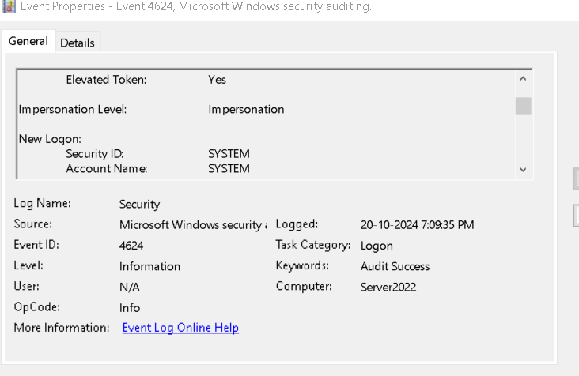

#### 4634

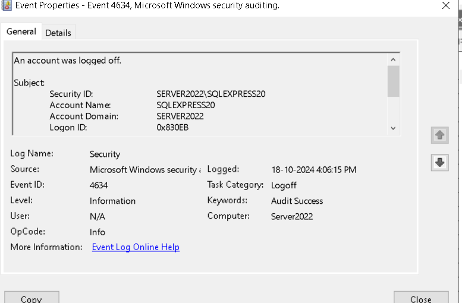

#### 4648

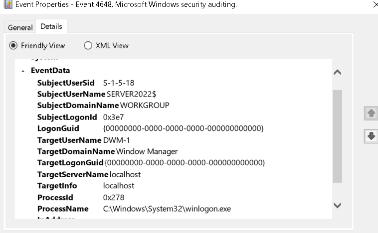

#### 4672 

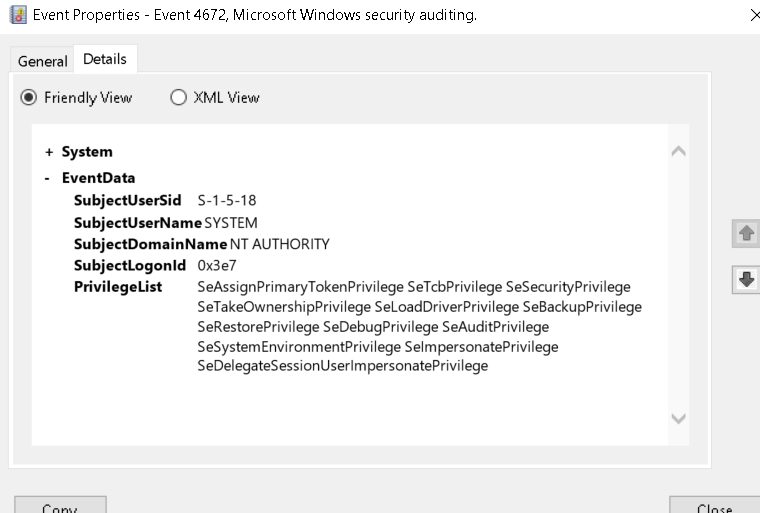

### Task 2: Local Logging: Cấu hình, Giám sát và Phân tích IIS Logs

Bật dịch vụ ISS 

Thực hiện tấn công sqlmap lệnh sau:
`sqlmap -u "http://www.moviescope.com/viewprofile.aspx?id=7" --cookie="mscope=jJH/XtdJK24=; ui-tabs-1=0"  -D moviescope --tables`
 
Sau khi tấn công thành công vào path sau check log:  C:\inetpub\logs\logFiles

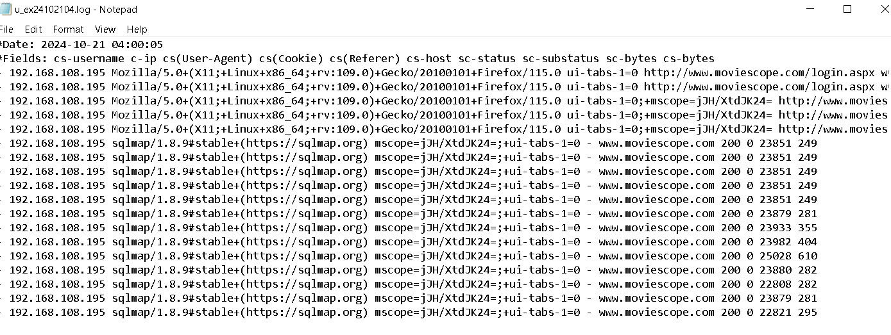

### Task 3: Local Logging: Cấu hình, Giám sát và Phân tích IDS Logs 

Kiểm tra danh sách card mạng bằng lệnh: `snort -W`

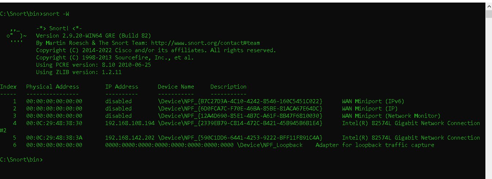

Để kích hoạt card mạng lên thì ta dùng lệnh `snort -dev -i 4` và nhấn Enter. Trong đó -i 4 là số Index của card mạng

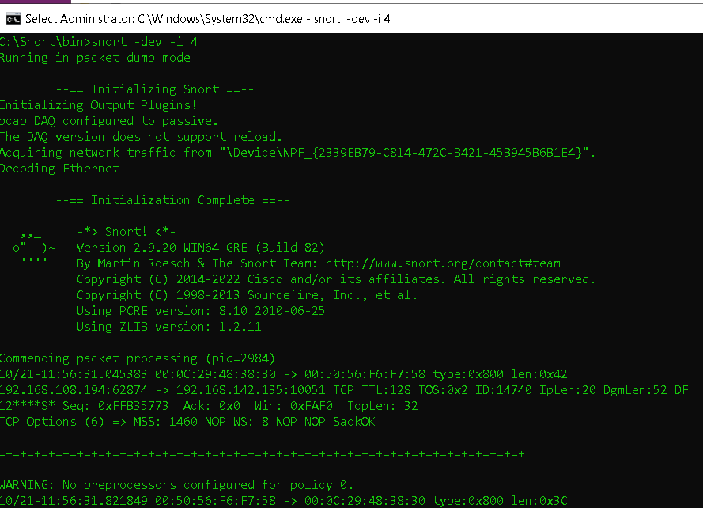

Mở thêm 1 tab test ping tới máy kali ip sau: `ping 192.168.108.195`

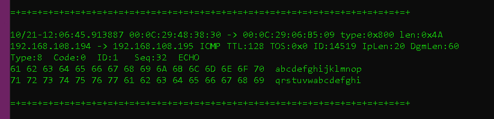

Sau khi cấu hình các file config xong chạy lệnh sau: `snort -i4 -A console -c C:\Snort\etc\snort.conf -l C:\Snort\log -A full`

Chạy đúng râ kết quả như sau: có pid=722 

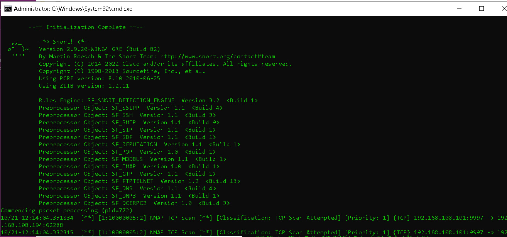

Mở máy kali để  ra các log liên quan đến network scanning
Cú pháp : 192.168.108.194: IP máy windows-server
- nmap -sN -T4 -A -v 192.168.108.194
- nmap -sX -T4 192.168.108.194
- nmap -sF -T4 192.168.108.194
- nmap -sU -T5 192.168.108.194

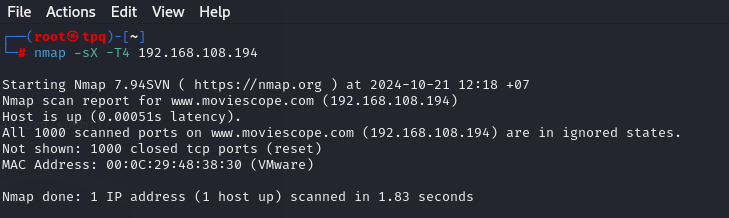

Sau khi hoàn tất tấn công để xem các log của Snort IDS mở thư mục `C:\Snort\log` sẽ thấy tệp có tên `alert.ids`

Kết quả: TCP và FIN scan

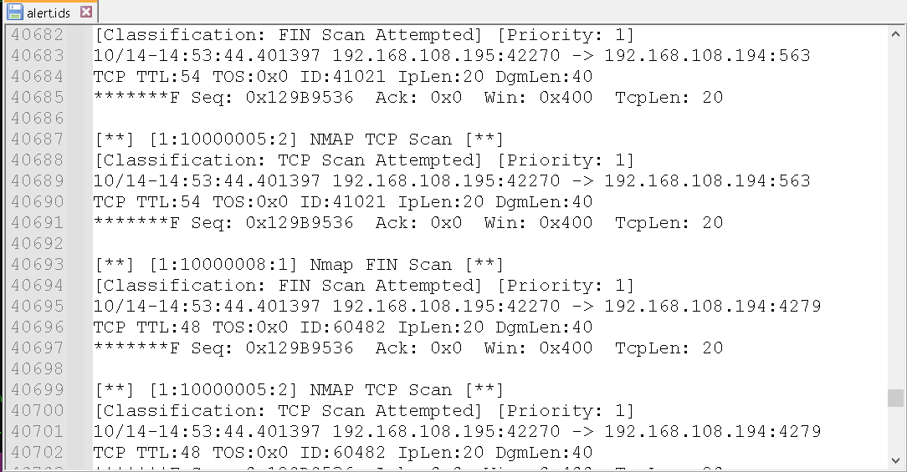