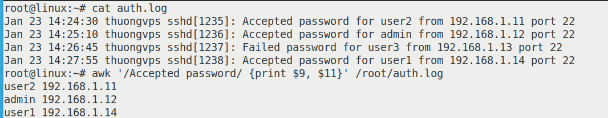
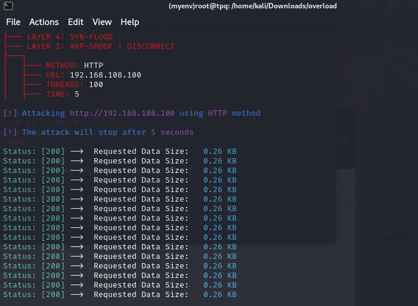

## Giám sát mạng
### Task 2: Xem nội dung của Log File 

Để xem người dùng hiện đang đăng nhập vào máy chủ Linux, sử dụng lệnh `who`

Lệnh `last` cho ta biết lịch sử đăng nhập của người dùng

Ta cũng có thể sử dụng lệnh last kết hợp pipe command (|) để thêm tìm 
kiếm bằng grep cho các người dùng cụ thể:

Để biết lần cuối hệ thống khởi động lại, ta có thể chạy lệnh sau: `last reboot`

Để xem lần đăng nhập cuối cùng của người dùng vào hệ thống, có thể sử dụng 
lệnh: `lastlog`

### Task 3: Dùng Command-Line Tools với Logs File - cat hoặc less 

Lênh `cat` chủ yếu được sử dụng để hiển thị toàn bộ nội dung của một hoặc nhiều tệp đọc file sau: `cat /var/log/syslog`

Lệnh `less` là một công cụ phân trang cho phép xem nội dung tệp theo từng màn hình: `less /var/log/vsftpd.log` 

Lệnh `tail` được sử dụng để hiển thị những dòng cuối cùng của một tệp khi giám sát các cập nhật log theo thời gian thực (-f) và điều này đặc biệt hữu ích đối với các tệp log : `tail -n 5 /var/log/boot.log`

Lệnh `head` cho phép xem những dòng đầu tiên của một tệp, bao gồm các tệp log lệnh dưới đây sẽ hiển thị 7 dòng đầu tiên của tệp log: `head -n 7 /var/log/apt/history.log`

Lệnh `grep` trong Linux được thiết kế để tìm kiếm các mẫu (pattern) hoặc chuỗi văn bản cụ thể trong các tệp, bao gồm cả tệp log lệnh sau để tìm kiếm từ session opened trong tệp log: `grep "session opened" /var/log/auth.log `

Kết hợp cat với grep :

 Lệnh `journalctl` cho phép cấu hình các cài đặt của journald và hiển thị các mục log cũng dùng để xem logs, theo thời gian thực (-f), số lượng log hiển thị (-n), thông báo kernel (-k) và hiển thị một dịch cụ cụ thể (-u):

Mặc định 

Số lượng 

Thời gian thực 

Kết hợp với grep 

### Task 4: Script và tự động hóa với Logs File 

[Linkdown](https://loliteam.net/xem_log)

`wget -cO - https://loliteam.net/xem_log > xemlogs.sh`

`gedit xemlogs.sh`

`chmod +x xemlogs.sh `

`./xemlogs.sh`

Kết quả:

Hãy thử thêm các cách khác

### Task 5: Parse Log  
`Parse log` là quá trình phân tích và trích xuất thông tin có ý nghĩa từ raw log 
(log thô) và chuyển đổi chúng thành log index (log đã được chỉ mục), giúp dễ 
dàng tìm kiếm, phân tích và theo dõi. Các hệ thống ghi lại rất nhiều thông tin 
thô dưới dạng log, và việc xử lý, lọc, phân tích chúng là cực kỳ quan trọng trong 
việc quản trị hệ thống, an ninh mạng, và xử lý sự cố

`AWK` là một công cụ mạnh mẽ dùng để xử lý và phân tích văn bản, đặc biệt 
hữu ích khi parse log trong các hệ thống Linux. AWK có khả năng trích xuất, 
thao tác và định dạng dữ liệu từ các tệp log một cách linh hoạt và hiệu quả

Ví dụ: `awk '/Accepted password/ {print $9, $11}' /root/auth.log
`

Trong đó:

`/Accepted password/`: Phần này của lệnh là một điều kiện tìm kiếm 
(pattern matching). Cụ thể, nó sẽ kiểm tra từng dòng trong file log và chỉ chọn 
những dòng có chứa cụm từ "Accepted password"
 + Chỉ những dòng có chứa cụm từ "Accepted password" sẽ được xử lý tiếp
 + Những dòng như "Failed password" sẽ bị bỏ qua

`{print $9, $11}`: Đây là hành động (action) được thực hiện khi điều kiện ở 
trên thỏa mãn. Nó sử dụng lệnh print để in ra hai trường trong mỗi dòng log đã 
chọn:
 + Mỗi dòng trong file log /var/log/auth.log được chia thành các trường (columns) dựa trên khoảng trắng
 + awk đánh số các trường bắt đầu từ $1, $2, ..., $n
 + $9: Đây là cột thứ 9 của dòng. Theo ví dụ, cột này chứa tên người dùng (user) mà đã đăng nhập thành công
 + $11: Đây là cột thứ 11 của dòng. Cột này chứa địa chỉ IP của máy đã thực hiện kết nối SSH

Nâng cao hơn ta có thể kết hợp với pipecommand như lệnh bên dưới: `awk '/Accepted password/ {print $11}' /root/auth.log | sort | uniq -c | sort -nr 
`

Trong đó:

+ `sort`: Sắp xếp kết quả
+ `uniq -c`: Đếm số lần xuất hiện của mỗi IP
+ `sort -nr`: Sắp xếp theo thứ tự giảm dần theo số lượng

Ví dụ phân tích log thực tế với AWK phát hiện tấn công DoS 

[Github](https://github.com/7zx/overload)

`git clone https://github.com/7zx/overload `

`cd overload` 

`apt install python3-pip`

`pip3 install -r requirements.txt`

`python3 overload.py`

Nếu chạy lỗi lệnh sau:

Tạo một môi trường ảo: `python3 -m venv myenv`

Kích hoạt môi trường ảo: `source myenv/bin/activate`

Tắt môi trường ảo: `deactivate`

Trong đó:
+ Method ta chọn HTTP để nhấm vào dịch vụ Web 
+ URL ta sẽ nhập địa chỉ IP của máy SOC-Linux  
+ THREADS ta nhập 100 để tạo 100 luồng tấn công mỗi giây 
+ TIME ta nhập 5 để tấn công trong vòng 5 giây

Khi quá trình tấn công DoS ta sang máy SOC-Linux và dùng lệnh tail để theo dõi log dịch vụ apache dùng lệnh: `tail -f /var/log/apache2/access.log `

Log ở trên cho thấy địa chỉ IP 192.168.108.195 đã gửi nhiều yêu cầu GET đến trang web trong một khoảng thời gian ngắn. Dùng grep để lọc các yêu cầu GET lệnh sau: `grep "GET" /var/log/apache2/access.log | awk '{print $1}' `

Tiếp theo ta sắp xếp và đếm số lần xuất hiện của mỗi IP bằng cách dùng (sort) và đếm số lần mỗi IP xuất hiện (uniq -c). Điều này giúp xác định IP nào đã gửi nhiều yêu cầu lệnh sau: `grep "GET" /var/log/apache2/access.log | awk '{print $1}' | 
sort | uniq -c`

Kết quả cuối cùng sẽ cho thấy địa chỉ IP nào đã gửi nhiều yêu cầu nhất trong 
khoảng thời gian cụ thể. Nếu thấy một số lượng lớn yêu cầu đến từ cùng một IP 
hoặc các IP lạ, đây có thể là dấu hiệu của một cuộc tấn công DDoS

#### Grok Debug: Công cụ Parsing Log 

Grok là một công cụ mạnh mẽ trong Logstash giúp trích xuất dữ liệu từ các tệp log dựa trên các mẫu (patterns). Grok thường được sử dụng để phân tích log trong các hệ thống ELK (Elasticsearch, Logstash, Kibana)

Ta có thể sử dụng Grok Debugger để thử nghiệm các mẫu (patterns) cho log mà ta muốn phân tích. Một số mẫu cơ bản bao gồm: 
+ `%{IPV4:client_ip}`: Trích xuất địa chỉ IP từ log.
+  `%{TIMESTAMP_ISO8601:timestamp}`: Trích xuất thời gian
+  `%{WORD:method} %{URIPATHPARAM:request}`: Trích xuất phương thức 
HTTP và URL từ log

 Ta có Log thô của Apache từ tấn công DoS ở trên. Tiến hành truy cập công cụ Grok Debugger trực tuyến để nhập log và mẫu grok để xem kết quả phân tích :  [GrokDebugger](https://grokdebugger.com/)

Phân tích log file lệnh sau: `tail -n 20 /var/log/apache2/access.log` 

Nhớ copy hết kết quả với lệnh tail

Lên trang [GrokDebugger](https://grokdebugger.com/)

/var/log/syslog 

#### 
  Parse log từ: /var/log/syslog 

Lệnh sau: `tail -n 15 /var/log/syslog`

`Samples nhập: sau`:

Oct 22 00:30:01 linux CRON[12495]: (CRON) info (No MTA installed, discarding output)

Oct 22 00:30:14 linux systemd[1]: vsftpd.service: start operation timed out. Terminating.

Oct 22 00:30:14 linux systemd[1]: vsftpd.service: Failed with result 'timeout'.

Oct 22 00:30:14 linux systemd[1]: Failed to start vsftpd FTP server bug by Thuong.

Oct 22 00:30:15 linux systemd[1]: vsftpd.service: Scheduled restart job, restart counter is at 171.

Oct 22 00:30:15 linux systemd[1]: Stopped vsftpd FTP server bug by Thuong.

Oct 22 00:30:15 linux systemd[1]: Starting vsftpd FTP server bug by Thuong...

Oct 22 00:31:01 linux CRON[12536]: (tomcat) CMD (/opt/tomcat/bin/startup.sh)

Oct 22 00:31:01 linux CRON[12535]: (CRON) info (No MTA installed, discarding output)

Oct 22 00:31:45 linux systemd[1]: vsftpd.service: start operation timed out. Terminating.

Oct 22 00:31:45 linux systemd[1]: vsftpd.service: Failed with result 'timeout'.

Oct 22 00:31:45 linux systemd[1]: Failed to start vsftpd FTP server bug by Thuong.

Oct 22 00:31:45 linux systemd[1]: vsftpd.service: Scheduled restart job, restart counter is at 172.

Oct 22 00:31:45 linux systemd[1]: Stopped vsftpd FTP server bug by Thuong.

Oct 22 00:31:45 linux systemd[1]: Starting vsftpd FTP server bug by Thuong...

`Grok Pattern` nhập:

%{SYSLOGTIMESTAMP:timestamp} %{HOSTNAME:hostname} %{WORD:program}\[%{NUMBER:pid}\]: %{GREEDYDATA:message}

Trong đó:
+ `timestamp`: Thời gian của log
+ `hostname`: Tên máy chủ nơi xảy ra sự kiện
+ `program`: Tên chương trình (ví dụ: CRON, systemd)
+ `pid`: Mã tiến trình
+ `message`: Nội dung log thực tế

`Output`: 

[
  {
    "timestamp": "Oct 22 00:30:01",
    "hostname": "linux",
    "program": "CRON",
    "pid": 12495,
    "message": "(CRON) info (No MTA installed, discarding output)"
  },
  {
    "timestamp": "Oct 22 00:30:14",
    "hostname": "linux",
    "program": "systemd",
    "pid": 1,
    "message": "vsftpd.service: start operation timed out. Terminating."
  },
  {
    "timestamp": "Oct 22 00:30:14",
    "hostname": "linux",
    "program": "systemd",
    "pid": 1,
    "message": "vsftpd.service: Failed with result 'timeout'."
  },
  {
    "timestamp": "Oct 22 00:30:14",
    "hostname": "linux",
    "program": "systemd",
    "pid": 1,
    "message": "Failed to start vsftpd FTP server bug by Thuong."
  },
  {
    "timestamp": "Oct 22 00:30:15",
    "hostname": "linux",
    "program": "systemd",
    "pid": 1,
    "message": "vsftpd.service: Scheduled restart job, restart counter is at 171."
  },
  {
    "timestamp": "Oct 22 00:30:15",
    "hostname": "linux",
    "program": "systemd",
    "pid": 1,
    "message": "Stopped vsftpd FTP server bug by Thuong."
  },
  {
    "timestamp": "Oct 22 00:30:15",
    "hostname": "linux",
    "program": "systemd",
    "pid": 1,
    "message": "Starting vsftpd FTP server bug by Thuong..."
  },
  {
    "timestamp": "Oct 22 00:31:01",
    "hostname": "linux",
    "program": "CRON",
    "pid": 12536,
    "message": "(tomcat) CMD (/opt/tomcat/bin/startup.sh)"
  },
  {
    "timestamp": "Oct 22 00:31:01",
    "hostname": "linux",
    "program": "CRON",
    "pid": 12535,
    "message": "(CRON) info (No MTA installed, discarding output)"
  },
  {
    "timestamp": "Oct 22 00:31:45",
    "hostname": "linux",
    "program": "systemd",
    "pid": 1,
    "message": "vsftpd.service: start operation timed out. Terminating."
  },
  {
    "timestamp": "Oct 22 00:31:45",
    "hostname": "linux",
    "program": "systemd",
    "pid": 1,
    "message": "vsftpd.service: Failed with result 'timeout'."
  },
  {
    "timestamp": "Oct 22 00:31:45",
    "hostname": "linux",
    "program": "systemd",
    "pid": 1,
    "message": "Failed to start vsftpd FTP server bug by Thuong."
  },
  {
    "timestamp": "Oct 22 00:31:45",
    "hostname": "linux",
    "program": "systemd",
    "pid": 1,
    "message": "vsftpd.service: Scheduled restart job, restart counter is at 172."
  },
  {
    "timestamp": "Oct 22 00:31:45",
    "hostname": "linux",
    "program": "systemd",
    "pid": 1,
    "message": "Stopped vsftpd FTP server bug by Thuong."
  },
  {
    "timestamp": "Oct 22 00:31:45",
    "hostname": "linux",
    "program": "systemd",
    "pid": 1,
    "message": "Starting vsftpd FTP server bug by Thuong..."
  },
  null
]

Hình ảnh tổng quan:

