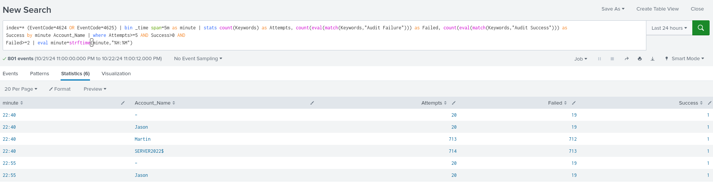
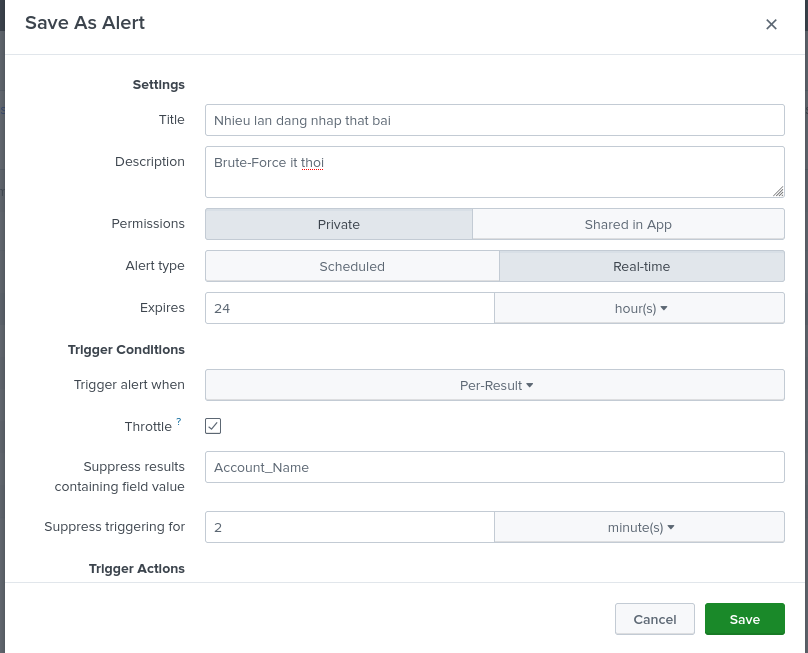
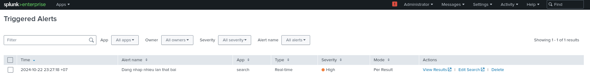
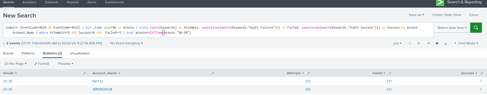

## Giám sát mạng
### Task 1: Phát hiện sự cố ở Host: Dùng Splunk Use Case để phát hiện và cảnh báo Brute-Force

Thực hiện lại tấn công Brute-Force và FTP xong 

Tạo cảnh báo về những lần đăng nhập không thành công từ `Alert` 

Sau khi thiết lập `Alert` tấn công lại bruteforce 

Vào `Activity `sau đó chọn tiếp `Triggered Alers`

### Task 2: Phát hiện sự cố ở Host: Dùng Splunk Use Case để phát hiện và cảnh báo các thay đổi trong Registry

